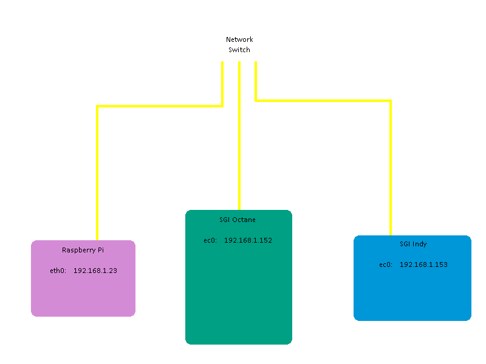
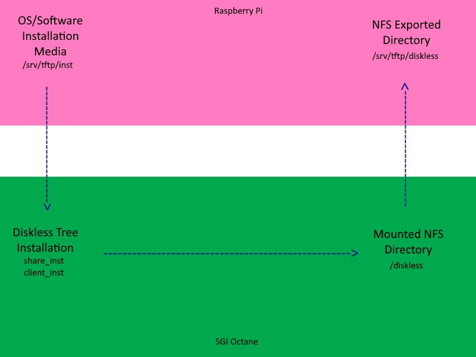

# SGI IRIX Net Booting Guide by Example

## Table of Contents
- [SGI IRIX Net Booting Guide by Example](#sgi-irix-net-booting-guide-by-example)
  - [Table of Contents](#table-of-contents)
  - [Typographic Conventions](#typographic-conventions)
  - [Introduction](#introduction)
  - [Requirements](#requirements)
    - [Hardware](#hardware)
    - [Software](#software)
  - [Concept](#concept)
  - [Linux Machine Setup](#linux-machine-setup)
    - [isc-dhcp-server](#isc-dhcp-server)
    - [nfs-kernel-server](#nfs-kernel-server)
    - [tftpd-hpa](#tftpd-hpa)
    - [rpc-server](#rpc-server)
  - [Mock SGI Server Setup](#mock-sgi-server-setup)
  - [Diskless Tree Installation](#diskless-tree-installation)
  - [Diskless Tree Post-Installation](#diskless-tree-post-installation)
    - [bootparamd](#bootparamd)
    - [nfs-kernel-server contd.](#nfs-kernel-server-contd)
  - [SGI Net Boot Setup](#sgi-net-boot-setup)
  - [Troubleshooting](#troubleshooting)
    - [PANIC: KERNEL FAULT](#panic-kernel-fault)
    - [TFTP failure: get ...](#tftp-failure-get-)
    - [NFS server \<server\> not responding still trying](#nfs-server-server-not-responding-still-trying)
    - [Port mapper failure](#port-mapper-failure)

## Typographic Conventions

Ellipsis (...) in the code blocks just means "there might be stuff above or below this". Anything to the right of an ellipsis is just a comment.

**Boldface** file paths accompanied by a code block show where this file is located and what content will be added/edited.

## Introduction
&nbsp;&nbsp;&nbsp;&nbsp;This guide explains how to configure and maintain Silicon Graphics software on a modern linux machine so that one or more networked SGI machines can net boot the IRIX operating system.  The linux server software will be configured to both boot installation material as well as boot IRIX itself for the clients.

&nbsp;&nbsp;&nbsp;&nbsp;Throughout this guide, a specific setup will be used to give an example of what a configuration would look like.  The network setup is described below:
- Raspberry Pi 4 - 4 GB model
  - Raspberry Pi OS 64-bit
- SGI Octane
  - IRIX 6.5.22 on local disk (explained later)
  - IRIX 6.5.22 64-bit desired net boot
- SGI Indy
  - IRIX 5.3 32-bit desired as net boot
- Network switch

&nbsp;&nbsp;&nbsp;&nbsp;This is the extent of my confirmed working setup, however this should work with any machine capable of completing the [Diskless Workstation Administration Guide](https://web.archive.org/web/20220326024413/https://techpubs.jurassic.nl/library/manuals/0000/007-0855-080/pdf/007-0855-080.pdf) setup processes client-side.

## Requirements
### Hardware
- SGI machine(s)
  - At least one with local IRIX installation
- Server machine
- Networking equipment (switches, ethernet cables)

### Software
- IRIX installation software
- IRIX NFS software package
- Linux software packages (these are available for Raspberry Pi OS, but any package that provides the same service should work. Configurations may vary):
  - bootparamd
  - isc-dhcp-server
  - nfs-kernel-server
  - rsh-server
  - tftpd-hpa

&nbsp;&nbsp;&nbsp;&nbsp;An NFS software package must be available for each IRIX version installed.

&nbsp;&nbsp;&nbsp;&nbsp;Knowledge on how to use inst or the software manager is also needed.  The original [Software Installation and Licensing](https://web.archive.org/web/20211122115932/https://irix7.com/techpubs/007-1364-140.pdf) manual contains that info.  Example selections files are in the example folder of the repository.

## Concept

&nbsp;&nbsp;&nbsp;&nbsp;Originally, the [Diskless Workstation Administration Guide](https://web.archive.org/web/20220326024413/https://techpubs.jurassic.nl/library/manuals/0000/007-0855-080/pdf/007-0855-080.pdf) describes a networked system where a diskless tree is locally created on an SGI. After installation, client SGIs can be configured to use the server for OS purposes.  Here, we will be doing essentially the same thing but with one catch: the SGI server will play pretend and install to a modern server instead.  The modern server will be given the software necessary to communicate with the SGI clients so that the clients don't know the difference.

&nbsp;&nbsp;&nbsp;&nbsp;The network setup is straightforward; all machines can talk over LAN.  If the modern server needs internet, you can use a second interface or just hook the LAN up to a router with internet access.



&nbsp;&nbsp;&nbsp;&nbsp;The visual below demonstrates how the diskless tree installation makes a full round-trip.  Install media is provided by the Pi and can be accessed by the Octane's software management system.  The Octane will install the diskless tree to an NFS mounted directory pointing to a local directory back on the Pi.



## Linux Machine Setup


`sudo apt install bootparamd isc-dhcp-server nfs-kernel-server rsh-server tftpd-hpa`

&nbsp;&nbsp;&nbsp;&nbsp;Place any IRIX packages you want to install to a directory accessible via tftp.  For the example, the directory used is the default at /srv/tftp. The folder storing the installation media will be /srv/tftp/inst.

### isc-dhcp-server

&nbsp;&nbsp;&nbsp;&nbsp;The DHCP server will attempt to start up but fail because configuration is required first. The example only utilizes the ethernet interface.  You will need each client's LAN IP address and MAC address from the NVRAM environment variables.  Information on how to find/edit these variables can be found [here](https://web.archive.org/web/20220401164835/http://retrogeeks.org/sgi_bookshelves/SGI_Admin/books/IA_ConfigOps/sgi_html/ch09.html).

&nbsp;&nbsp;&nbsp;&nbsp;The defaults for the isc-dhcp-server will be edited:

**/etc/default/isc-dhcp-server**
```
...
INTERFACESv4="eth0"
...
```

&nbsp;&nbsp;&nbsp;&nbsp;Next, we'll tell the server a little about mapping hostnames to IP addresses:

**/etc/hosts**
```
...
127.0.1.1               raspberrypi
192.168.1.152           octane
192.168.1.153           indy
```

&nbsp;&nbsp;&nbsp;&nbsp;Then we'll allow any user from the SGI clients to log in (this is what [booterizer](https://github.com/unxmaal/booterizer) does, so it's a copy paste):

**/etc/hosts.equiv**
```
+ +
```

&nbsp;&nbsp;&nbsp;&nbsp;Finally, the server's configuration file will be edited to allow booting protocols, a subnet definition, and the clients' networking information:

**/etc/dhcp/dhcpd.conf**
```
...
allow booting;
allow bootp;

subnet 192.168.1.0 netmask 255.255.255.0 { ignore unknown-clients; }

host octane {
        hardware ethernet 08:00:69:13:68:da;
        fixed-address 192.168.1.152;
        }

host indy {
        hardware ethernet 08:00:69:08:76:a1;
        fixed-address 192.168.1.153;
        }
```

&nbsp;&nbsp;&nbsp;&nbsp;To restart and verify the isc-dhcp-server is working correctly, restart and check the status of the service:

`service isc-dhcp-server restart`

`service isc-dhcp-server status`

### nfs-kernel-server

&nbsp;&nbsp;&nbsp;&nbsp;The NFS server has two purposes:

1. Network folder to load IRIX installation media
2. Network folder to install IRIX software to

&nbsp;&nbsp;&nbsp;&nbsp;The Octane will be used as the mock SGI server. We're going to pretend the filesystem it is installing the diskless tree to is local. Instead, the directory will be network mounted from a directory on the raspberry pi. The installation media will be located within the /srv/tftp/inst folder and the diskless tree will be installed to the /srv/tftp/diskless folder.

&nbsp;&nbsp;&nbsp;&nbsp;Verify that NFS versions 2 and 3 are enabled.  The following line may need to be added to your defaults:

**/etc/default/nfs-kernel-server**
```
...
RPCNFSDOPTS="--nfs-version 2 --nfs-version 3 --no-nfs-version 4"
```

&nbsp;&nbsp;&nbsp;&nbsp;You can check if the specific NFS versions are enabled/disabled by using the following command:

`cat /proc/fs/nfsd/versions`

If you changed the defaults, restart the NFS service and verify the service is active:

`service nfs-kernel-server restart`

`service nfs-kernel-server status`

&nbsp;&nbsp;&nbsp;&nbsp;Next, the directories inside the tftp-accessible directory will need to be exported for NFS.  Since the mock server will only need access to these top level locations, only the Octane will be given access:

**/etc/exports**

```
...
/srv/tftp/inst          octane(rw,no_root_squash,no_subtree_check)
/srv/tftp/diskless      octane(rw,no_root_squash,no_subtree_check)
```

&nbsp;&nbsp;&nbsp;&nbsp;Update the NFS server's exported directories and check for errors:

`exportfs -r`

### tftpd-hpa

&nbsp;&nbsp;&nbsp;&nbsp;The TFTP server will handle file transfers to and from the client SGIs.

&nbsp;&nbsp;&nbsp;&nbsp;For creation of files and troubleshooting purposes, the default options for the TFTP service will be edited:

**/etc/default/tftpd-hpa**

```
...
TFTP_OPTIONS="--secure --create -vvvv"
```

&nbsp;&nbsp;&nbsp;&nbsp;To restart and verify the service is active, run the service commands:

`service tftpd-hpa restart`

`service tftpd-hpa status`

### rpc-server

&nbsp;&nbsp;&nbsp;&nbsp;The RPC server will handle any remote calls by SGI's programs requiring access to a server shell.

&nbsp;&nbsp;&nbsp;&nbsp;Add the guest user to the Pi server.

`adduser --home /srv/tftp --shell /bin/ksh --disabled-password guest`

&nbsp;&nbsp;&nbsp;&nbsp;Add a .rhosts file to the TFTP directory (this is what [booterizer](https://github.com/unxmaal/booterizer) does, so it's a copy paste):

**/srv/tftp/.rhosts**
```
octane  guest
indy    guest
```

&nbsp;&nbsp;&nbsp;&nbsp;Since this service is managed under the inetd super server, we'll restart that.

`service inetd restart`

`service inetd status`

## Mock SGI Server Setup

&nbsp;&nbsp;&nbsp;&nbsp;The mock server requires a working local IRIX install including the nfs.sw.dskless_server subsystem.  This can be done using `inst` or the software manager.  The NFS software can be found in the ONC3/NFS Version 3 installation media (for 6.2-6.5).  Note from the original documentation, in order to install a diskless IRIX the server's OS must be later or equal to the OS version being installed on the diskless tree.  The example is using 6.5.22 on the Octane's local disk.

Add the raspberry pi's IP to the mock server's /etc/hosts file.

**/etc/hosts**

```
...
192.168.1.23  raspberrypi
```

&nbsp;&nbsp;&nbsp;&nbsp;Mount the diskless directory over NFS:

`mkdir /diskless`

`mount raspberrypi:/srv/tftp/diskless /diskless`

## Diskless Tree Installation

&nbsp;&nbsp;&nbsp;&nbsp;SGI's [Diskless Workstation Administration Guide](https://web.archive.org/web/20220326024413/https://techpubs.jurassic.nl/library/manuals/0000/007-0855-080/pdf/007-0855-080.pdf) chapters 3 and 4 (save the last couple of pages of chapter 4) are essentially what the procedure is during this phase.  For software selection, I used the commands that [booterizer](https://github.com/unxmaal/booterizer) uses for inst.  I then added the NFS dskless_client subsystem.  If there will be many installs, selections files are your friend.  The installation programs will ask you if you are sure you want to install to an NFS directory. Just continue and install as many versions as you desire.

&nbsp;&nbsp;&nbsp;&nbsp;For the example, a share tree will be installed for 64-bit 6.5.22 and 32-bit 5.3.  A client tree will be installed for the Octane and Indy as well.  The generated share and client .dat files can be found in the repository's example folder.

Installing diskless tree for two IRIX versions and two clients:
```
cd /var/boot
./share_setup
... (6.5.22 file created)
./share_setup
... (5.3.dat file created)
./share_inst -r 6.5.22
... (6.5.22 share tree installed at /diskless/share/6.5.22)
./share_inst -r 5.3
... (5.3 share tree installed at /diskless/share/5.3)
./client_setup
... (Octane.dat file created)
./client_setup
... (Indy.dat file created)
./client_inst -h octane -r 6.5.22 -c Octane
... (octane client tree installed to /diskless/client/octane)
./client_inst -h indy -r 5.3 -c Indy
... (indy client tree installed to /diskless/client/indy)
```

Sometimes the installer might throw warnings about a deadlock being prevented or post-install scripts not working.  This seems to be okay as far as I know.

## Diskless Tree Post-Installation

### bootparamd

&nbsp;&nbsp;&nbsp;&nbsp;Bootparams contain a list of client entries used for booting diskless clients.  Referencing the generated version on the mock server, this should be moved over to the Pi server's bootparams file.  Note that the raspberry pi's IP is used instead of the hostname.

**/etc/bootparams**

```
...
octane  root=192.168.1.23:/srv/tftp/diskless/client/octane \
        sbin=192.168.1.23:/srv/tftp/diskless/share/6.5.22/sbin \
        usr=192.168.1.23:/srv/tftp/diskless/share/6.5.22/usr \
        var_share=192.168.1.23:/srv/tftp/diskless/share/6.5.22/var/share \
        swap=192.168.1.23:/srv/tftp/diskless/swap/octane
indy    root=192.168.1.23:/srv/tftp/diskless/client/indy \
        sbin=192.168.1.23:/srv/tftp/diskless/share/5.3/sbin \
        usr=192.168.1.23:/srv/tftp/diskless/share/5.3/usr \
        var_share=192.168.1.23:/srv/tftp/diskless/share/5.3/var/share \
        swap=192.168.1.23:/srv/tftp/diskless/swap/indy
6.5.22  root=192.168.1.23:/srv/tftp/diskless/share/6.5.22 \
        sbin=192.168.1.23:/srv/tftp/diskless/share/6.5.22/sbin \
        swap=192.168.1.23:
5.3     root=192.168.1.23:/srv/tftp/diskless/share/5.3 \
        sbin=192.168.1.23:/srv/tftp/diskless/share/5.3/sbin \
        swap=192.168.1.23:
```

&nbsp;&nbsp;&nbsp;&nbsp;Restart and verify that the bootparamd service is working correctly:

`service bootparamd restart`

`service bootparamd status`

### nfs-kernel-server contd.

&nbsp;&nbsp;&nbsp;&nbsp;Each client will need NFS access to their respective client tree as well as their share tree.  Again, this will be generated after the mock server installs the trees and should be moved over and appended to the Pi server's exports file.

&nbsp;&nbsp;&nbsp;&nbsp;This is a sample of what exports are required for the octane client:

&nbsp;&nbsp;&nbsp;&nbsp;(Note that the share tree's software version must be identical to the installed client tree's software version and that the swap export below is synced)

**/etc/exports**

```
/srv/tftp/diskless/client/octane          octane(rw,no_root_squash,no_subtree_check)
/srv/tftp/diskless/swap/octane            octane(rw,sync,no_root_squash,no_subtree_check)
/srv/tftp/diskless/share/6.5.22/usr       octane(ro,no_root_squash,no_subtree_check)
/srv/tftp/diskless/share/6.5.22/sbin      octane(ro,no_root_squash,no_subtree_check)
/srv/tftp/diskless/share/6.5.22/var/share octane(rw,no_root_squash,no_subtree_check)
```

&nbsp;&nbsp;&nbsp;&nbsp;For each client tree installed, the network configuration may be incorrect due to the mock server not knowing this setup will only be temporary.  Each client tree's hosts file should list itself along with it's LAN IP and the Pi server's IP:

**/srv/tftp/diskless/\<client\>/etc/hosts**

```
...
192.168.1.23  raspberrypi
192.168.1.152 octane

```

&nbsp;&nbsp;&nbsp;&nbsp;Make sure the client's host name is what it should be too:

**/srv/tftp/diskless/\<client\>/etc/sys_id**

```
octane
```

&nbsp;&nbsp;&nbsp;&nbsp;The file systems table may also have incorrect entries pointing to the wrong host.  Make sure the host these are pointing to is the Pi server:

**/srv/tftp/diskless/\<client\>/etc/fstab**

```
raspberrypi:/srv/tftp/diskless/client/octane / nfs rw 0 0
raspberrypi:/srv/tftp/diskless/share/6.5.22/usr /usr nfs ro 0 0
raspberrypi:/srv/tftp/diskless/share/6.5.22/sbin /sbin nfs ro 0 0
raspberrypi:/srv/tftp/diskless/share/6.5.22/var/share /var/share nfs rw 0 0
raspberrypi:/srv/tftp/diskless/swap/octane /swap nfs rw 0 0
```

## SGI Net Boot Setup

&nbsp;&nbsp;&nbsp;&nbsp;Note: Me personally, I took a picture with my phone of the initial environment variables before changing them for ease of reverting back to the previous configuration.

&nbsp;&nbsp;&nbsp;&nbsp;After all that work, it's time for the final step (unless something goes wrong).  The SGI client's boot-up environment variables need to be configured to auto-boot into network mode.  On some machines, there may be other variables that need changing as well.  Documentation can be found at the end of chapter 4 in SGI's [Diskless Workstation Administration Guide](https://web.archive.org/web/20220326024413/https://techpubs.jurassic.nl/library/manuals/0000/007-0855-080/pdf/007-0855-080.pdf).  Information on how to find/edit these variables can be found [here](https://web.archive.org/web/20220401164835/http://retrogeeks.org/sgi_bookshelves/SGI_Admin/books/IA_ConfigOps/sgi_html/ch09.html).

```
setenv diskless 1
setenv OSLoader /unix
setenv SystemPartition bootp():diskless/client/octane
setenv OSLoadPartition bootp():diskless/client/octane
init
```

&nbsp;&nbsp;&nbsp;&nbsp;Hopefully, starting up the machine gives you a successfull network boot!  First time setup may involve configuring the kernel, so a clean shut down will be needed.  After that, the boot should be a bit faster.

## Troubleshooting

&nbsp;&nbsp;&nbsp;&nbsp;SGI's [Diskless Workstation Administration Guide](https://web.archive.org/web/20220326024413/https://techpubs.jurassic.nl/library/manuals/0000/007-0855-080/pdf/007-0855-080.pdf) provides a list of erros and troubleshooting hints near the end of the document.  Any additional problems will be listed below.

### PANIC: KERNEL FAULT

&nbsp;&nbsp;&nbsp;&nbsp;This is either due to the client and share tree OS versions not matching (as described in the original guide) or the config files pointing to the wrong OS directories.

 - check the client.dat and share.dat to ensure matching OS versions and modes were used during the tree install process.
 - check the client's /etc/fstabs and the server's /etc/exports and /etc/bootparams files to ensure the paths are pointing to the correct OS version installed.

### TFTP failure: get ...

- check bootparams config files for correct pathing
- check /etc/exports for correct pathing

### NFS server \<server\> not responding still trying
### Port mapper failure

&nbsp;&nbsp;&nbsp;&nbsp;Hostnames may be mismatched in client config files. The client also may not have guest permissions for the rcp server.

- check the client's /etc/fstab, /etc/sys_id, and /etc/hosts file for incorrect entries
- check the rcp server configuration files
